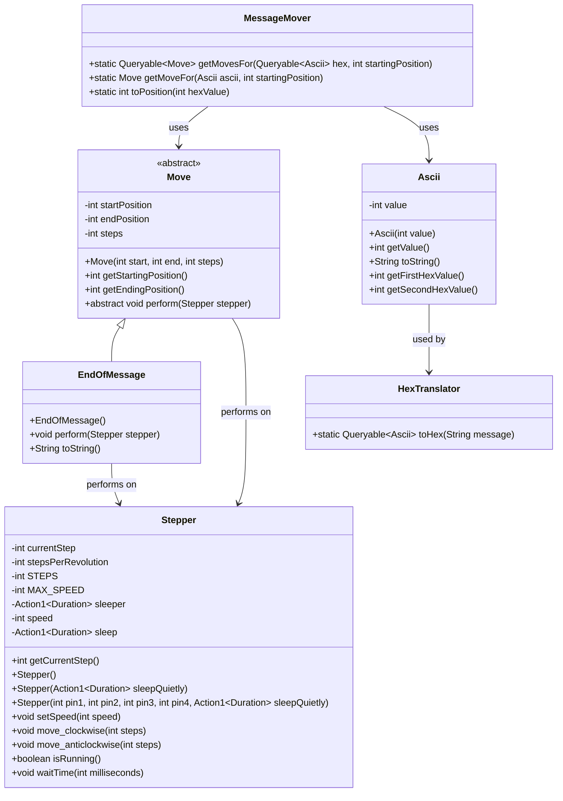

Martian Message
===============

For exercise instructions see [top level README](../README.md)

```mermaid
classDiagram
    class Ascii {
        -int value
        +Ascii(int value)
        +int getValue()
        +String toString()
        +int getFirstHexValue()
        +int getSecondHexValue()
    }

    class Move {
        <<abstract>>
        -int startPosition
        -int endPosition
        -int steps
        +Move(int start, int end, int steps)
        +int getStartingPosition()
        +int getEndingPosition()
        +abstract void perform(Stepper stepper)
    }

    class EndOfMessage {
        +EndOfMessage()
        +void perform(Stepper stepper)
        +String toString()
    }

    class HexTranslator {
        +static Queryable~Ascii~ toHex(String message)
    }

    class MessageMover {
        +static Queryable~Move~ getMovesFor(Queryable~Ascii~ hex, int startingPosition)
        +static Move getMoveFor(Ascii ascii, int startingPosition)
        +static int toPosition(int hexValue)
    }

    class Stepper {
        -int currentStep
        -int stepsPerRevolution
        -int STEPS
        -int MAX_SPEED
        -Action1~Duration~ sleeper
        -int speed
        -Action1~Duration~ sleep
        +int getCurrentStep()
        +Stepper()
        +Stepper(Action1~Duration~ sleepQuietly)
        +Stepper(int pin1, int pin2, int pin3, int pin4, Action1~Duration~ sleepQuietly)
        +void setSpeed(int speed)
        +void move_clockwise(int steps)
        +void move_anticlockwise(int steps)
        +boolean isRunning()
        +void waitTime(int milliseconds)
    }

    Ascii --> HexTranslator : used by
    Move <|-- EndOfMessage
    MessageMover --> Move : uses
    MessageMover --> Ascii : uses
    EndOfMessage --> Stepper : performs on
    Move --> Stepper : performs on

```